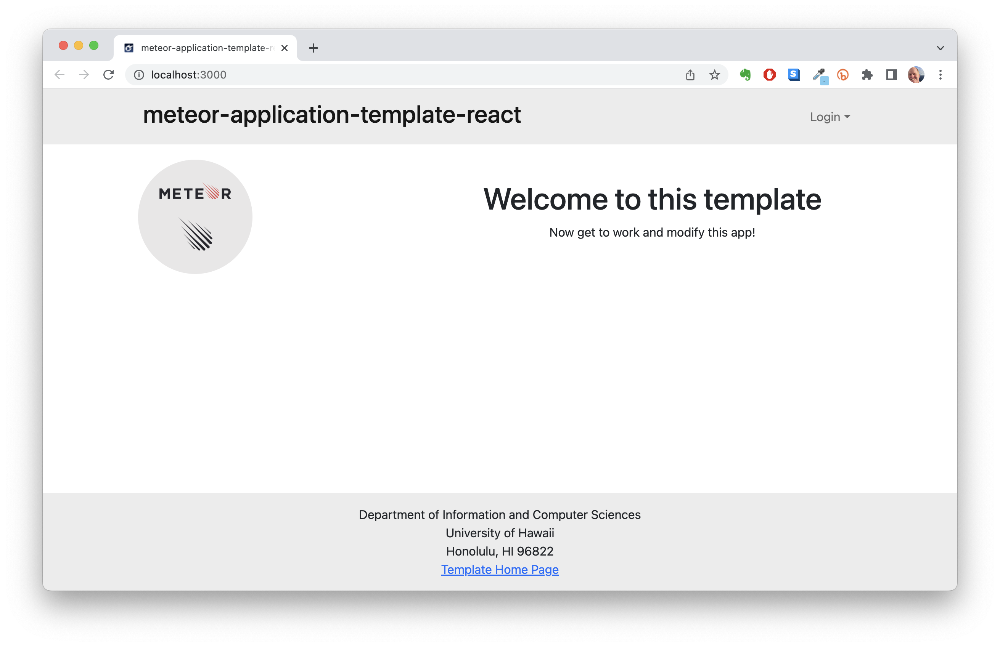

## The Keys to Software Design
Have you ever had to go through someone else's code and spend hours trying to understand it? This is where design patterns come in handy as they allow for software developers to work collaboratively by following a certain pattern. Having a set of guidelines that everyone is able to learn and follow makes working with other people's code easier to understand and work with. Not only does design patterns help with collaboration, but they improve the flexibility and maintainability of our solutions. In essence these are a template or a blueprint that can be used for solving various problems, they are not the exact solutions but a guide that must be modified to fit the needs of your problems.

One may ask what is the difference between a design pattern and an algorithm? The answer to this question is not simple, as yes they share a common similarity in that they are a guide to solving a software problem. However, the difference is that algorithms are usually set up with some base code and lays out a sequence of steps to implement in order to solve the problem. A design pattern will show you the capabilities of the code and different things that can be implemented, but the user is the one who will decide how they will implement their solution.

## Using These Keys to Unlock Your Software Potential
Now that the keys to software design have been discussed, I will discuss how I used design patterns to improve my software design skills. One of the design patterns that I used when working with software design was the meteor-application-template-react that was used for various assignments throughout my ICS 314 course. This template can be considered a design pattern as it shows you some of the capabilities of the code but allows you to design your solution in any way that you see fit. When working on the final project for ICS 314, it is a group project so using the meteor-application-template-react as a baseline helped to improve collaboration. Having a basis of code and developing off of it using similar styles to a base template make it easier to go and look at a teammate's commits and understand what they are doing. Instead of having to learn the coding style of my teammates and having to adjust our codes accordingly to match each other, we use a baseline and follow that pattern so it is easier to integrate everyone's work together.

Another example of design patterns that I have used includes Bowfolios. Bowfolios is an application that is designed to show various profiles and includes more features and functionality than the meteor-application-template-react. I consider this a design pattern as it was developed by experienced software designers and has been well tested and can be used as a template for other projects. It also has a developer/user guide that explains how everything works so that a future user can go in and modify this base template to implement another project based off of this design pattern.
