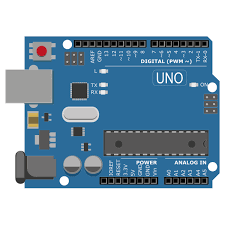
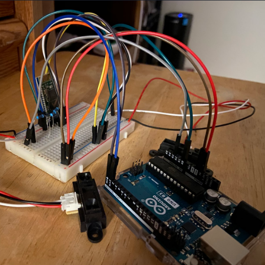
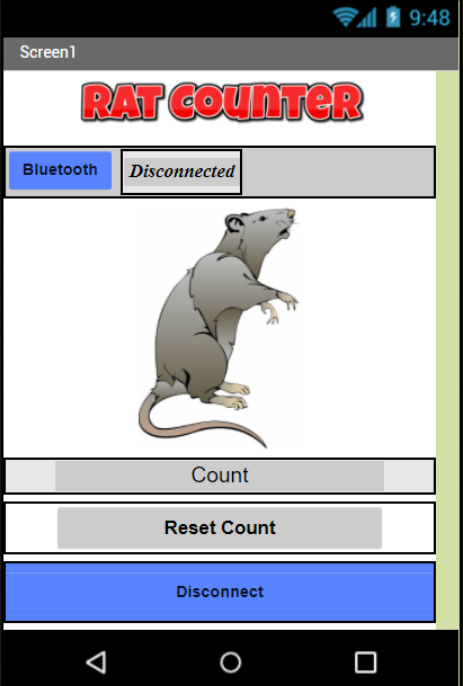

  

 The goal of this project was to incorporate an Arduino with other hardware and connect it to an app that we created using MIT AppInventor. At the start we went through som basic tutrials with our Arduino and MITAppInventor to become familiar with them before getting into the project. The idea for Rat Counter came from conservation work that uses rat tunnels and wanted a way to track how many rats pass through these tunnels. Using various motion sensors we set it up so anytime a rat sized thing had run past the sensor it would keep a counter and increment each time. The Arduino circuit created for this project is shown below. 
 

  

The next stage of this project was creating an app that could connect to the Arduino. Bluetooth was used to connect our Arduino and app. The app had a display that would show the user the counter that was stored in the Arduino and had a reset option that allowed the user to send back a reset to the Arduino and reset the count to one. Shown below is an image of the final app design with the counter and reset options shown.

  

Throughout this project my contribution was creating the app and writing the code for the sensors to be able to detect movement and keep a counter. I was able to succesfully have the sensor track movement and the Arduino store the counter and send it to the app and allowed the app to communicate back to the Arduino with the reset. From this project I learned basic circuit skills, how to use an Arduino and how to create simple apps. A brief demo can be watched [here](https://www.youtube.com/watch?v=o3JxgTAkWKg&t=2s).
