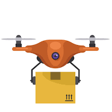
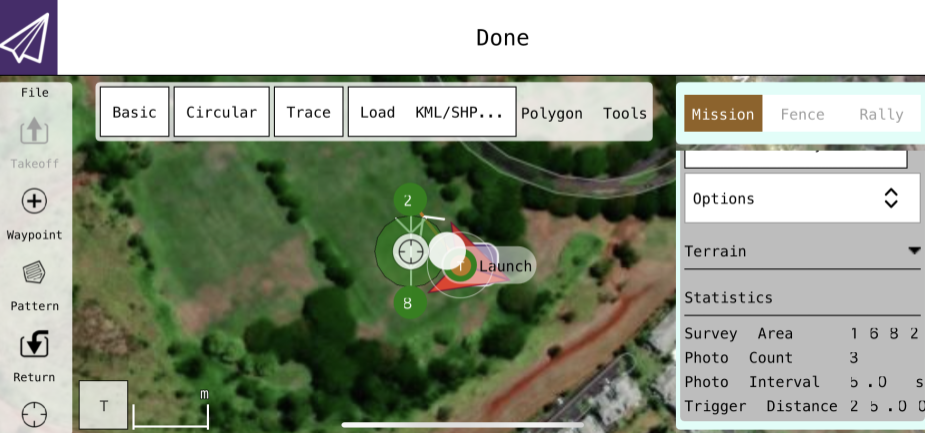

<div class="text-center p-4">
  
</div>
The goal of this project was to program a drone with Python to be able to do a mission autonomously. To get used to the code and practice with the commands we would first run simulations in a virtual machine with VirtualBox. We used an Ubuntu Linux OS to run our test code and flight simulations. We did various flight simulations such as a simple takeoff and land, a goto mission, and various others. Our simulations would have a minimap to show our flight progress and a console of the drone status, shown below is a script used for one of our simulations and the output of a simple takeoff simulation.

```python
from dronekit import connect
vehicle = connect('0.0.0.0:14550', wait_ready=True)

def arm_and_takeoff(aTargetAltitude):
    print("Basic pre-arm checks")
    # Don't try to arm until autopilot is ready
    while not vehicle.is_armable:
        print(" Waiting for vehicle to initialise...")
        time.sleep(1)

    print("Arming motors")
    # Copter should arm in GUIDED mode
    vehicle.mode = VehicleMode("GUIDED")
    vehicle.armed = True

    # Confirm vehicle armed before attempting to take off
    while not vehicle.armed:
        print(" Waiting for arming...")
        time.sleep(1)

    print("Taking off!")
    vehicle.simple_takeoff(aTargetAltitude)  # Take off to target altitude

    # Wait until the vehicle reaches a safe height before processing the goto
    #  (otherwise the command after Vehicle.simple_takeoff will execute
    #   immediately).
    while True:
        print(" Altitude: ", vehicle.location.global_relative_frame.alt)
        # Break and return from function just below target altitude.
        if vehicle.location.global_relative_frame.alt >= aTargetAltitude * 0.95:
            print("Reached target altitude")
            break
        time.sleep(1)

arm_and_takeoff(3)
```
<div class="text-center p-4">
  
</div>
The next part of this project was being able to program a real drone. In order to create missions for our drone we used QGroundControl from our virtual machines we created for the simulations as well as trying it with mobile devices. With this software we were able to set up a specific altitude that the drone would take off to as well as fly around a certain area. We were able to create a mission and set the speed the drone would fly and the altitude it would fly at througout the mission. Shown below is a sample mission we completed using a mobile device shown from the QGroundControl app. 
<div class="text-center p-4">
  
</div>
This project was a group of two and we each completed the simulations on our own and were able to compare results and help each other when needed. When getting to real drone we each took turns doing a mission with the drone and would provide support for each other when creating missions. From this experience I learned about virtual machines and how we can use them to simulate other operating systems and run our programs through the virtual machines. I also improved my Python skills when developing some of the code for the simulations and test flights. More infomation can be found [here](https://docs.google.com/presentation/d/1Spg-cYv_HIr1Y0wLw7PTHKQTtB-F1mT2O4TgucA4lBY/edit?usp=sharing) on our project poster.
