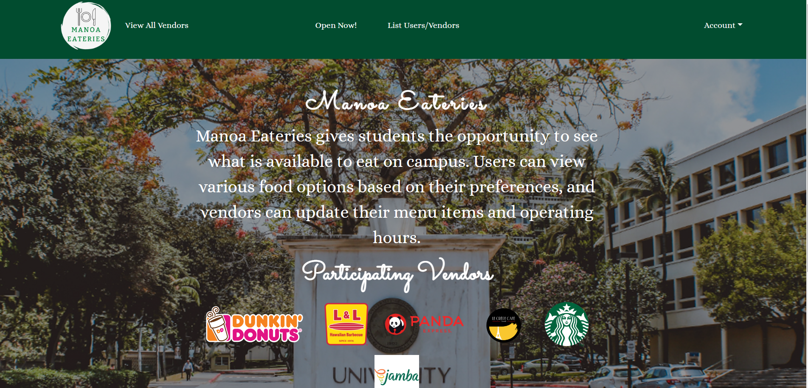
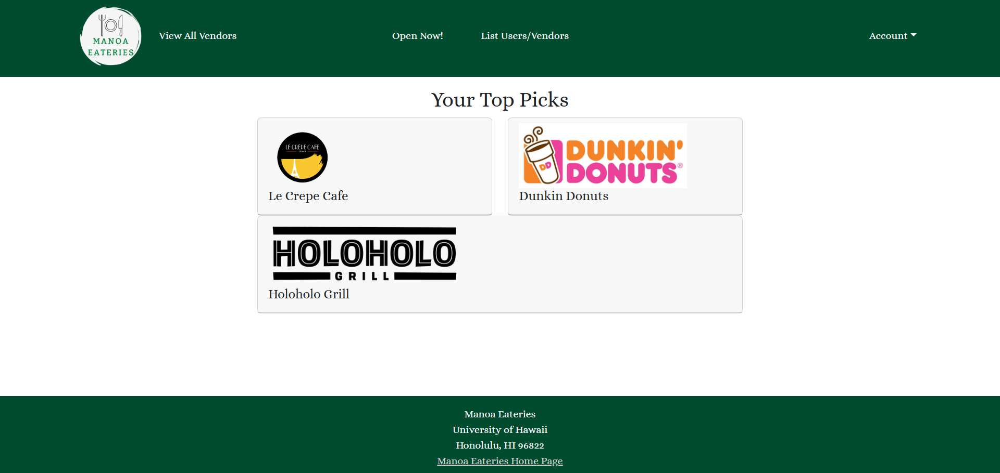

  

Manoa Eateries was a project done for ICS 314 and was completed with a team of four people. The main goal of this project was to develop a web application where users would be able to either sign-in or create an account ant view the vendors located on campus. Users are able to set their preferences and are suggested pages based on their preferences as shown in the image below. The image above shows the landing page which is the main page that everyone will see when they first visit the site. The landing page is visible to all users no matter if you are signed into an account or not. However, various other pages are only shown to you based on your assigned role. For users they are able to set their own preferences and see their own profile along with a recommendation of open food places. When a vendor is signed in they are able to access their respective vendor profiles and are able to edit any of the info. Admins are able to see a list of all vendor profiles and user profiles to be able to monitor the site. 

  
 

Throughout this project we split up the work by creating issues on GitHub and assigning one per person with multiple todos. Once someone would finish a task you could pull a new issue from the todo to work on and continued working until finishing the project. My specific parts in this project included working with the vendor information. I created a new role that was meant for vendors and added vendor protected routes so that the vendor pages were only accessible to someone who was signed in with the vendor role. I also created the vendor profile and vendor edit pages that allow a vendor to see their profiles and make any changes if necessary. I also added the admin page that allows for the admin to view all of the profiles created for both users and vendors. Another Job that I had throughout this project was keeping our home page up to date by updating screenshots of our pages and helping with the user guide. A link to our home page is shown [here](https://manoa-eateries.github.io/) this link will show a more detailed writeup of our project.
