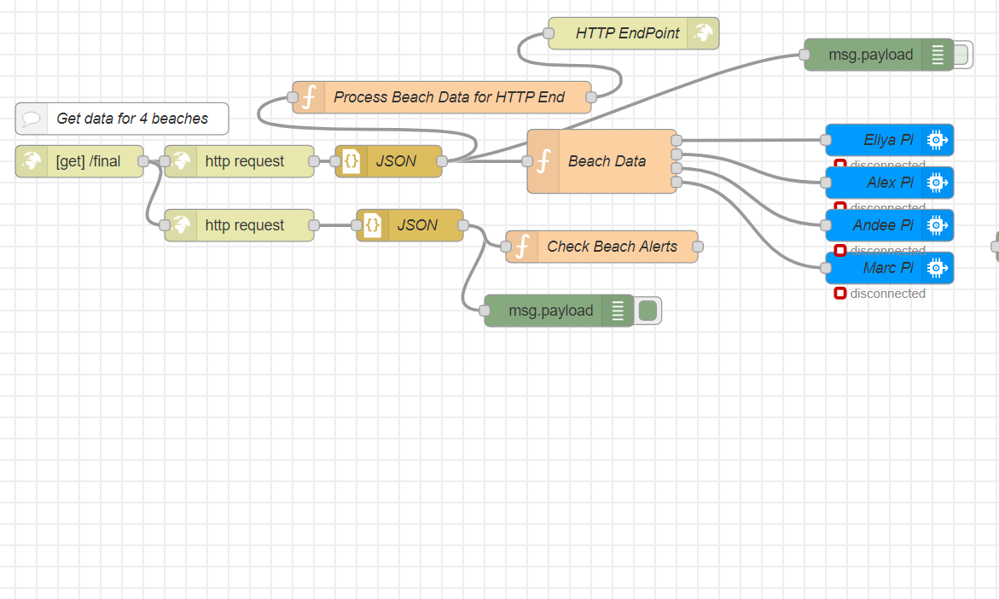
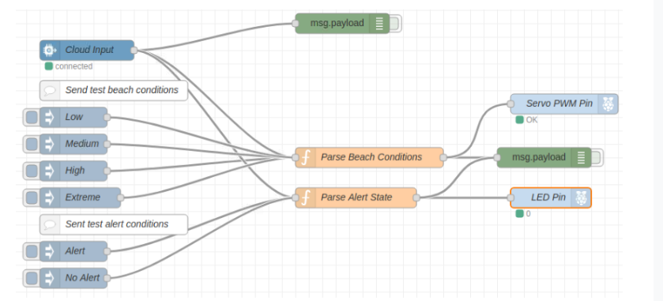

  
  

Watchtower was a project done using tools such as IBM Cloud, Raspberry Pi, and JavaScript. The main goal of the project was to use an API and retrieve the data into our cloud application and be able to send data from the cloud application to the Raspberry Pi device. To do this project we used the Hawaii Beach Safety API and pulled the beach conditions into our IBM Cloud. The next step was being able to process the specific beaches we wanted to track and send to the Raspberry Pi. The IBM Cloud would parse the data from a JSON file and send the data of a specific beach to each of the connected Raspberry Pi devices. The cloud also created an HTTP endpoint that presented the conditions of the beaches that were sent to the Raspberry Pi devices. 

  
 

The next step of this project was the Raspberry Pi device to process the data and display the condition of the beach. For this we created a homemade wheel that displayed the four possible conditions and an arrow that would be attached to a motor. The Raspberry Pi would be connected to a motor that would turn a variable number of degrees based on the beach conditions. The homemade arrow was attached to the motor and pointed to the corresponding beach conditions.
